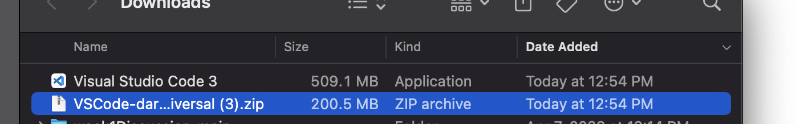
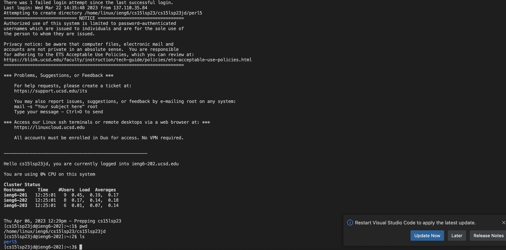
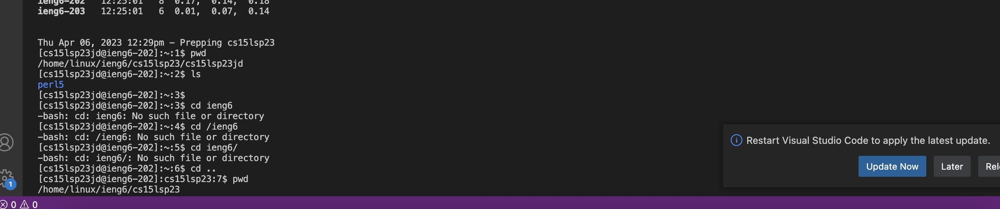

1) For installing VS Code, this was quite straightforward. I visited the VS Code website, downloaded the 
MacOS installer, followed the installation instructions, and ran it. The link to the installation is [here](https://go.microsoft.com/fwlink/?LinkID=534106)
https://go.microsoft.com/fwlink/?LinkID=534106

2) To connect to the remote server, it took a bit more work. It required me to search for my course account 
through the UCSD app, then use that to login to the remote server where I needed to input a password. The 
command I used to remotely connect was $ssh cs15lsp23jd@ieng6.ucsd.edu. This part was a bit tricky for me 
because the password did not appear to take characters, but after pressing enter, it seems that it did 
indeed register my key strokes. After, I was skeptical as it prompted me with a warning message that the
server was not authenticized, but I asked for help and it turns out it was normal.
 
3) Using commands I learned in the second lecture of CSE 15L, I was able to conduct a few commands to play 
with the server. I learned that cd changes your current directory to the directory you choose. ls is a direct 
consequence of this, as it changes accordingly to a new cd. The pwd command displays the current working directory you are in, cd changes the current directory you are in, ls lists the folders within the working directory, etc.
 
