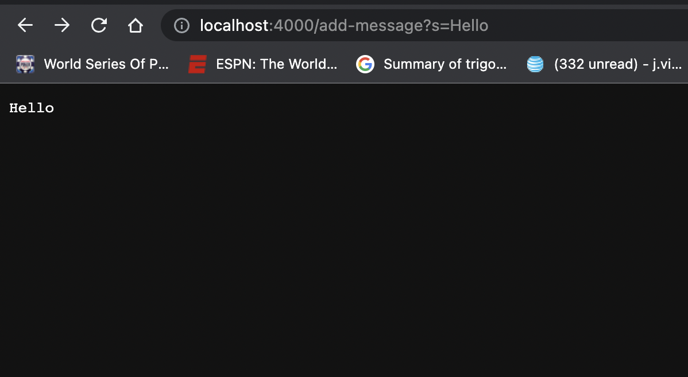
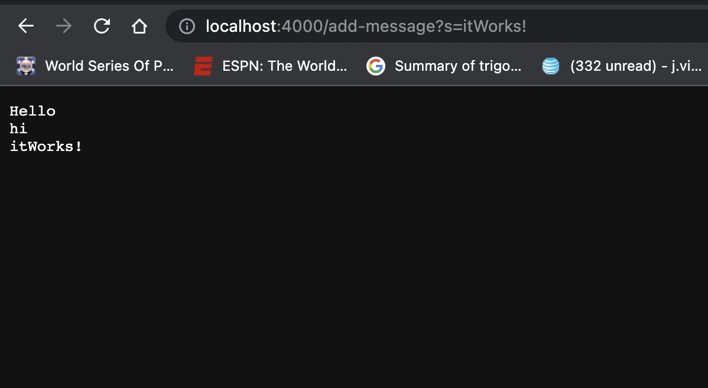
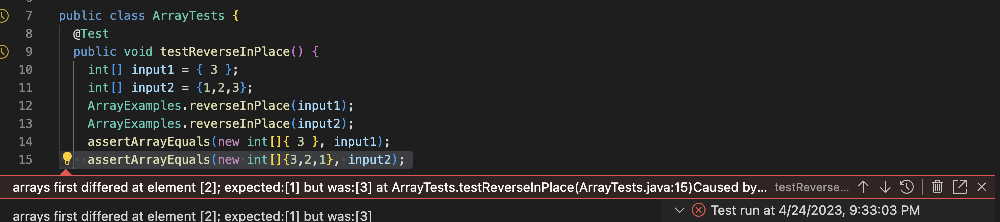

# Lab Report 2
### Part 1
The following is the code for the StringSearch file, as well as two screenshots using the method on a website in real time. 
```
import java.io.IOException;
import java.net.URI;


class Handler implements URLHandler {
    // The one bit of state on the server: a number that will be manipulated by
    // various requests.
    String input = "";
    public String handleRequest(URI url) {
        if (url.getPath().contains("/add-message")) {
            String[] isolate = url.getQuery().split("=");
            if (isolate[0].equals("s")) {
                input += isolate[1] + "\n";
                return input;
            }
        }
        return "404 Not Found!";
    }
}
class StringServer {
    public static void main(String[] args) throws IOException {
        if(args.length == 0){
            System.out.println("Missing port number! Try any number between 1024 to 49151");
            return;
        }

        int port = Integer.parseInt(args[0]);

        Server.start(port, new Handler());
    }
}
```

Firstly, the main method is run in the program which then calls the handleRequest method to 
carry-out the specified messages. The relavent arguments to that method is everything that comes after
"4000" in the url of the website. The only field that is initially considered when the class is run 
is input. The two variables that actively change during each call to the method is input and isolate. 
Input is responsible for displaying the correct action on the website, whichin this case making sure 
what is typed after "=" in the url is shown. Isolate changes as well when new words are added as an argument 
in the url. 

Once again, the main method is run when a new argument is inputed in the url and handRequest is used to print 
it out to the website. The relevant arguments is everything that comes after and including the first "/". 
The first variable to be considered is input in this case. But, there is a difference, now that the method has 
been 3 times, input stores the past 2 calls and displays all three products as one in the website. 
### Part 2
Below is the buggy code we will be referencing throughout the section:
```
public class ArrayExamples {
  static void reverseInPlace(int[] arr) {
    for(int i = 0; i < arr.length; i += 1) {
      arr[i] = arr[arr.length - i - 1];
    }
  }
```
The purpose of this method is to reverse the elements of an array. The following JUNIT test will show that this 
current method does not work.
```
public void testReverseInPlace() {
    int[] input2 = {1,2,3};
    ArrayExamples.reverseInPlace(input2); // {3,2,3}
    assertArrayEquals(new int[]{3,2,1}, input2);
```
The following is code that does not induce a failure. 
```
public void testReverseInPlace() {
    int[] input1 = { 3 };
    ArrayExamples.reverseInPlace(input1);
    assertArrayEquals(new int[]{ 3 }, input1);
```
Below is a screenshot of the sypmtoms of the failure inducing code.

Before the bug was fixed: 
```
public class ArrayExamples {
  static void reverseInPlace(int[] arr) {
    for(int i = 0; i < arr.length; i += 1) {
      arr[i] = arr[arr.length - i - 1];
    }
  }
```
After: 
```
static void reverseInPlace(int[] arr) {
    for(int i = 0; i < arr.length/2; i += 1) {
      int temp = arr[i];
      arr[i] = arr[arr.length - i - 1];
      arr[arr.length - i - 1] = temp;
    }
  }
```
### Part 3
Before this lab, I did not know it was possible to launch your own servers from a java program, let alone manipulate them from the url in real-time. I learned valauble debugging skills in code, as well as testing my code to check if my logic was correct. Although, what stood out to me in this particular lab was the complexity of the Server.java file- I am wondering what the file actually means such that it creates a website for the user.
