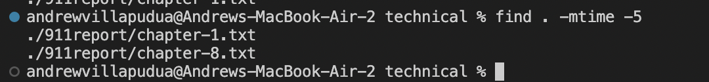
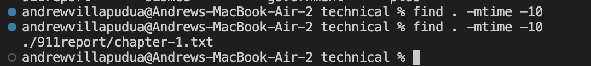
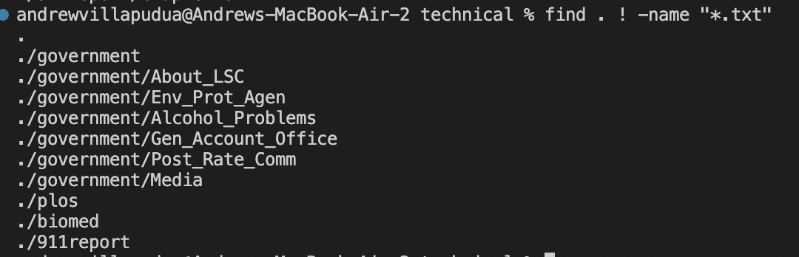
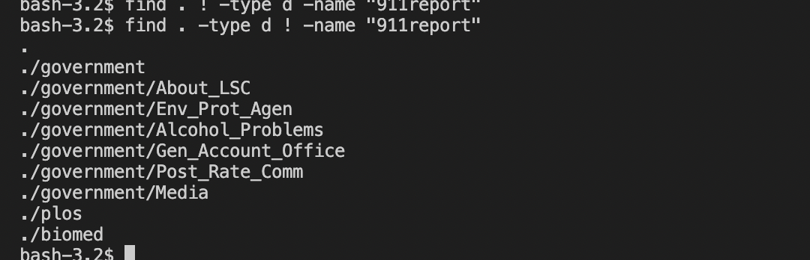
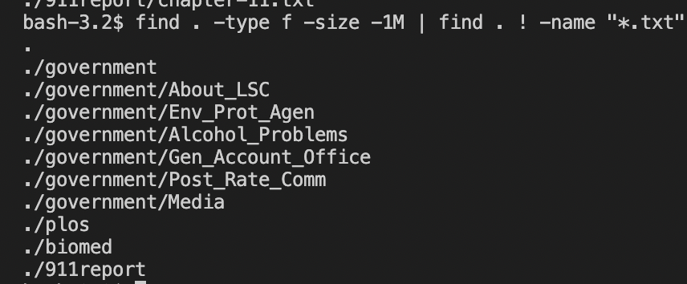
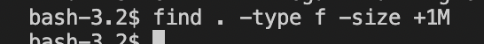
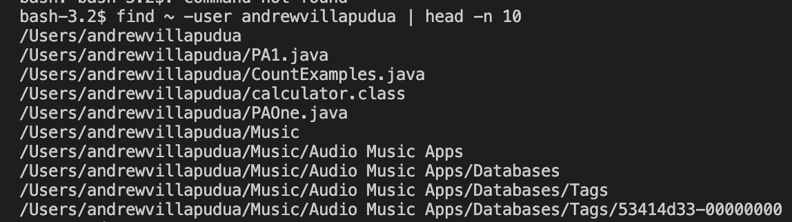
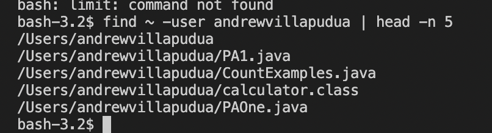

# Lab Report 3
For this report, I chose to expirement with the keyword "find." 
### First Option 
The first option I chose was using the -mtime -N use of find, to output all 
the files that have been modified within the past N days. I found this use on ChatGPT,
an online chat bot. The prompt I gave ChatGPT: "alternate uses of find in bash" it provided
me with "Find files modified within a certain time frame:" `find /path/to/directory -type f -mtime -7`
I changed the output a bit to show different uses of the keyword.

The . in these command lines tells the terminal to search the current directory, and 
-mtime means modified time, and -N is the span of days in which it was modified
### Second Option
The second option I chose was to use the ! operator, which finds all the files/directories 
that do not match the criteria. I also found this alternate use using ChatGPT. The prompt I 
gave ChatGPT: "how to use ! operator with find" and it prompted me with: 
`find /path/to/directory ! -name "filename"` I hanged the output to show different uses of it. 

The -type d command searches for directories only. 
### Third Option 
The third option I chose was the alternate use of find, the size operator. The size operator
is paired with -/+NM, where N is the number of megabytes each file/directory should be checked. 
The + will return any file directory greater than N megabytes, and - will return and file less
than N megabytes. This is useful because suppose you have a large directory with very large files, but you
would like to find a text file (which typically has a small amount of space). You would use this to find the 
text file or at least filter out all the large files to access the txt file more easily.
I found this alternate use here: https://linuxize.com/post/how-to-find-files-in-linux-using-the-command-line/

### Fourth Option
The fourth option I chose was the -user option, but because this led to an enormous output, I shortened
it using the head keyword. -user outputs all the files belonging to the user, and head prints the first N lines
of the output.

