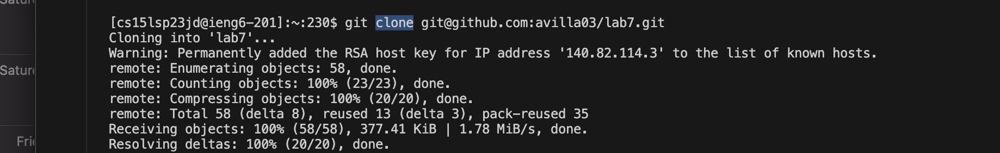
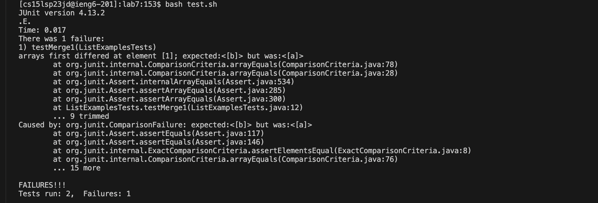
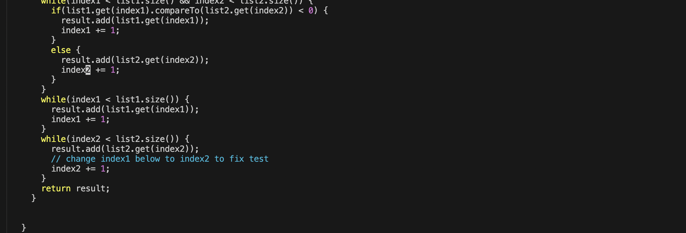
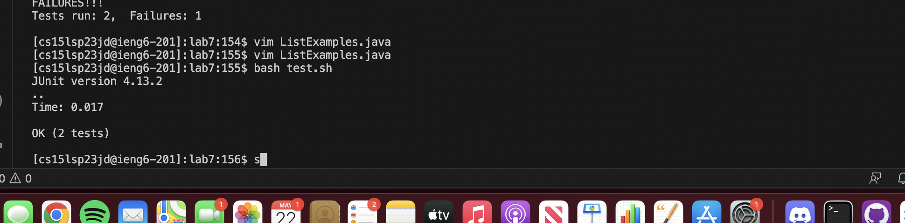
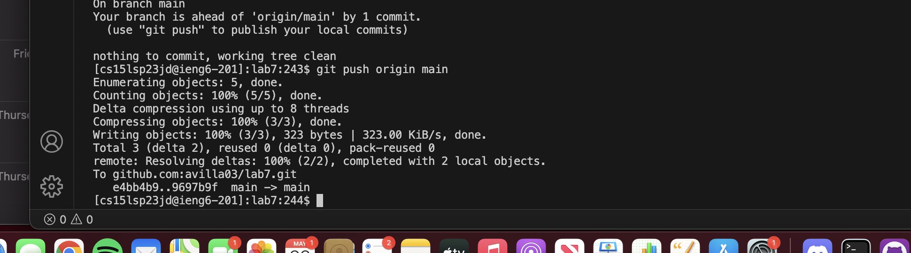

# Lab Report 4
### Step 1 - Log into ieng
Key strokes: `ssh cs15lsp23jd@ieng6-201.ucsd.edu<return><password><return>`
Summary: ssh command is used to login to the remote server

### Step 2 - Clone your fork of the repository from your Github account
Key strokes: `git clone <copy><paste><return>`
Summary: git clone command is used to clone a given repository, in this case, the lab7 repo

### Step 3 - Run the tests, demonstrating that they fail
Key strokes: `ls<enter>cd l<tab><enter>bash test.sh<enter>`
Summary: ls to see sbu directories, cd then l tab to get listexamples.java, then test.sh to test file

### Step 4 - Edit the code file to fix the failing test
Key strokes: `vim Li<tab>.java<enter>43jer2<esc>:wq`
Summary: vim ListExamples.java to enter vim, then followed by vim commands to edit.

### Step 5 - Run the tests, demonstrating that they now succeed
Key strokes - `bash test.sh<enter>`
Summary: run test.sh file

### Step 6 - Commit and push the resulting change to your Github account (you can pick any commit message!)
Key strokes - `git add ListExamples.java<return>git commit -m "ListExamples.java has been committed"<return>git push origin main<return>`
Summary: git add adds the changes to the file to the branch, commit commits the file to the branch, and push pushes the updated file to the repo.

