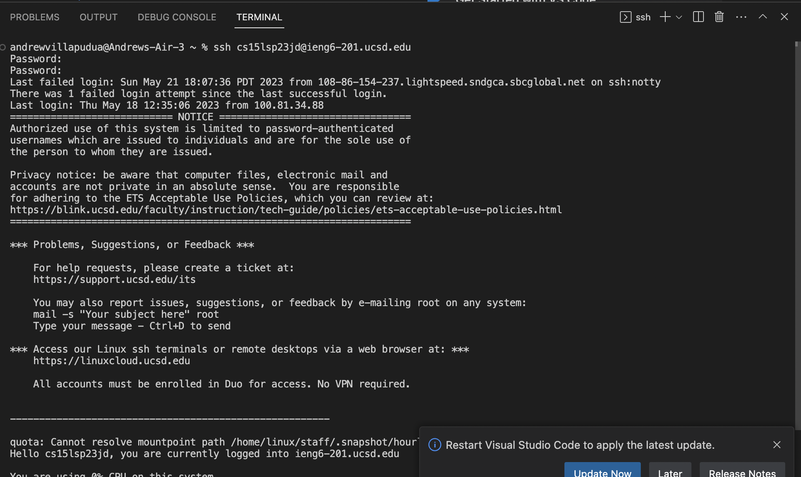

# Lab Report 4
### Step 1 - Log into ieng
Key strokes: ssh<space> cs15lsp23jd@ieng6-201.ucsd.edu<return>
<password><return>
 
### Step 2 - Clone your fork of the repository from your Github account
Key strokes: git clone <copy><paste><return>
### Step 3 - 
