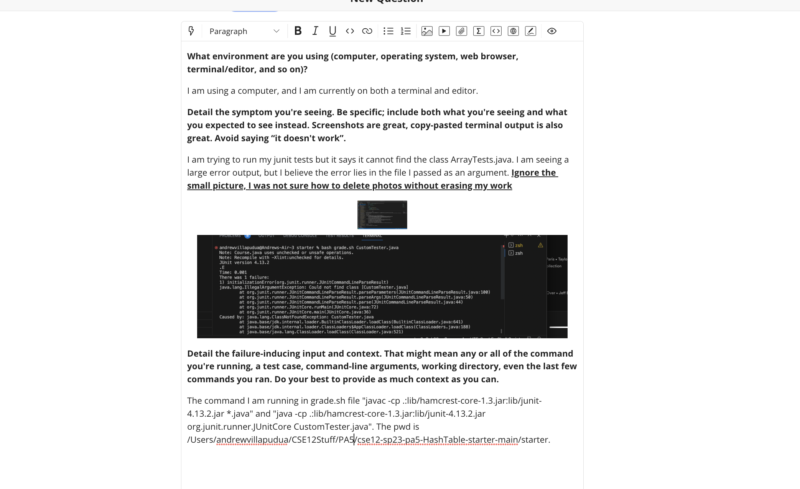
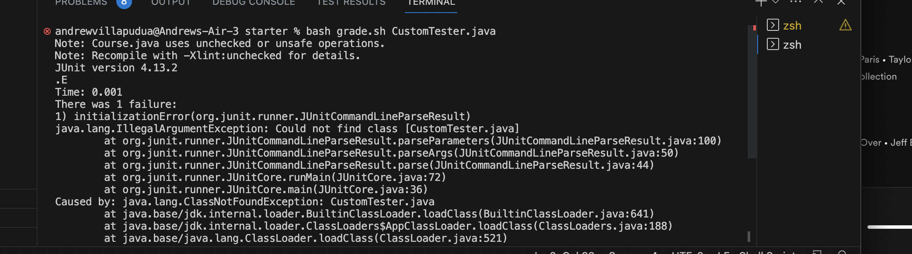

# Lab Report 5
## Part 1
### Task 1

### Task 2
TA: I see. There is a difference between javac and java. Javac compiles the code, and it requires you to add the entire java file name,
for ex., YourFile.java. However, the java command does not require the entire file name. How would you alter the java command with
this in mind?
### Task 3

The problem with the code initially was that .java was added with the java command. All that was needed to correct was to truncate the 
end of the command such that CustomTester.java became CustomTester.
### Task 4
1) The file and directory structure need: 
Files: grade.sh, CustomTester.java, Student.java, Course.java, Sanctuary.java
Directory: /Users/andrewvillapudua/CSE12Stuff/PA5/cse12-sp23-pa5-HashTable-starter-main/starter
2) When attempting to run CustomTester, the contents is as follows: 
`
public class CustomTester {
    Student stud, stud1;
    Course course, course1, course2;
    @Before 
    /**
     * a few objects to aid in my testing
     */
    public void setUp() {
        stud = new Student("Andrew","Villa","A172");
        stud1 = new Student("Andrew", "Villa", "B173");
        course = new Course("CSE", "12", "Great course", 10);
        course1 = new Course("CSE", "12", "Great course", 1);
        course2 = new Course("CSE", "12", "Great course", 200);
    }
    /**
     * Test to compare equals method with a non student object
     */
    @Test
    public void testStudentEquals() {
        assertFalse(stud.equals(5));
    }
    /**
     * Test uses the compareTo method with PID
     */
    @Test
    public void testStudentCompareTo() {
        int expected = "A172".compareTo("B173");
        int actual = stud.compareTo(stud1);
        assertEquals(expected, actual);
    }
    /**
     * Test to test drop method
     */
    @Test
    public void testCourseDrop() {
        course.enroll(stud);
        assertFalse(course.drop(stud1));
    }
    /**
     * Test to test the enroll method
     */
    @Test
    public void testCourseEnroll() {
        course1.enroll(stud);
        assertFalse(course1.enroll(stud1));
    }
    /**
     * Test the getRoster() method with 100+ students enrolled
     */
    @Test
    public void testCourseGetRoster() {
        for (int i = 0; i < 140; i++) {
            stud = new Student("Andrew","Villa","A172" + Integer.toString(i));
            course2.enroll(stud);
        }
        ArrayList<Student> courseAsList = new ArrayList<>();
        for (int i = 0; i < 140; i++) {
            stud = new Student("Andrew","Villa","A172" + Integer.toString(i));
            courseAsList.add(stud);
        }
        Collections.sort(courseAsList);
        assertEquals(courseAsList, course2.getRoster());
    }
    /**
     * Tests an exception when maxAnimals is -1
     */
    @Test(expected = IllegalArgumentException.class)
    public void testSanctConstructor() {
        Sanctuary tester = new Sanctuary(-1, 1);
    }
    /**
     * Aims to test the rescue method, 3 cannot be saved in this case
     */
    @Test
    public void testSanctRescuePartial() {
        Sanctuary tester = new Sanctuary(10, 1);
        tester.sanctuary.put("Panda",8);
        assertEquals(3, tester.rescue("Panda",5));
    }
    /**
     * Aims to test rescue when species is max, will reject any 
     * species when this is the case
     */
    @Test
    public void testSanctRescueMaxSpecies() {
        Sanctuary tester = new Sanctuary(10, 1);
        tester.sanctuary.put("Panda",8);
        assertEquals(1, tester.rescue("Koala", 1));
    }
    /**
     * Aims to test the release method, in this case 2 is left over
     */
    @Test
    public void testSanctReleasePartial() {
        Sanctuary tester = new Sanctuary(10, 1);
        tester.sanctuary.put("Panda", 5);
        tester.release("Panda",3);
        assertSame(2, tester.sanctuary.get("Panda"));
    }
    /**
     * Release method when it goes over the amount of animals,
     * species should be ridden in this case
     */
    @Test
    public void testSanctReleaseTooMany() {
        assertThrows(IllegalArgumentException.class, () -> {
            Sanctuary tester = new Sanctuary(10, 2);
            tester.sanctuary.put("Panda", 5);
            tester.release("Panda",7);
        });
        Sanctuary tester = new Sanctuary(10, 2);
        tester.sanctuary.put("Panda", 5);
        tester.sanctuary.put("Koala", 5);
        tester.release("Panda",7);
        assertFalse(tester.sanctuary.containsKey("Panda"));

    }
}
`
3) Command ran: bash grade.sh CustomTester.java
Contents of grade.sh:
`javac -cp .:lib/hamcrest-core-1.3.jar:lib/junit-4.13.2.jar *.java
java -cp .:lib/hamcrest-core-1.3.jar:lib/junit-4.13.2.jar org.junit.runner.JUnitCore $1
`
4) All that was needed to fix the bug was to truncate the end of the file to CustomTester.
## Part 2
Something interesting I learned was how to use and edit in VIM. I have known about VIM for a short time, when it was first
introduced to me by my housemate this year, and instantly I was intimidated by the non-conventional key strokes needed to navigate throught it. Now, I feel much more comfortable with it and am excited to use my skills in future classes.
